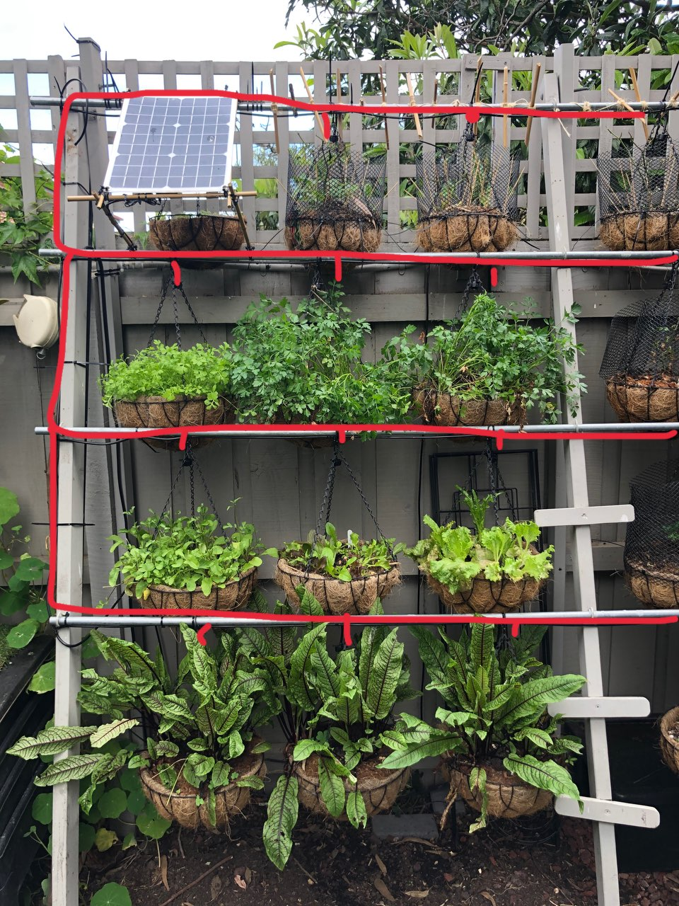

# My ESP Home Automation Devices

<table>
<tr>
</tr>
<tr>
<td><a href="./backyard_garden_hub.yaml"></td>
<td><a href="./backyard_garden_hub.yaml"></td>
<td><a href="./backyard_garden_hub.yaml"></td>
</tr>
<tr>
<td><a href="./camera_diymore.yaml"></td>
<td><a href="./camera_m5_xf.yaml"></td>
<td><a href="./camera_m5_xf.yaml"></td>
</tr>
<tr>
<td><a href="./dam_water_level_alarm.yaml"></td>
<td><a href="./dam_water_level_alarm.yaml"></td>
<td><a href="./dam_water_level_alarm.yaml"></td>
</tr>
<tr>
<td><a href="./garden_trellis.yaml"></td>
<td><a href="./garden_trellis.yaml"></td>
<td><a href="./garden_trellis.yaml"></td>
</tr>
<tr>
<td><a href="./garden_trellis.yaml"></td>
<td><a href="./living_room_env_sensor.yaml"></td>
<td><a href="./living_room_env_sensor.yaml"></td>
</tr>
<tr>
<td><a href="./living_room_ir_sensor.yaml"></td>
<td><a href="./patio_floodlight.yaml"></td>
<td><a href="./slot_car_track.yaml"></td>
</tr>
<tr>
<td><a href="./solar_hws_ctl.yaml"></td>
<td><a href="./solar_hws_ctl.yaml"></td>
<td><a href="./solar_hws_ctl.yaml"></td>
</tr>
<tr>
<td><a href="./studio_psu.yaml"></td>
<td><a href="./weather_oled.yaml"></td>
<td><a href="./wl_irrigation.yaml"></td>
</tr>
<tr>
<td><a href="./wl_irrigation.yaml"></td>
<td><a href="./wl_water_tank.yaml"></td>
<td><a href="./wl_water_tank.yaml"></td>
</tr>
<tr>
<td><a href="./wl_water_tank.yaml"></td>
<td><a href="./wl_water_tank.yaml"></td>
</table>

## Notes

### ESPHome

https://esphome.io/guides/getting_started_command_line.html

https://esphome.io/components/wifi.html

https://esphome.io/components/mqtt.html

https://www.home-assistant.io/docs/mqtt/discovery

https://www.home-assistant.io/components/esphome/

### Install

    pipenv install

    pipenv run esphome device_name.yaml run

### Wemos D1 Mini (ESP8266) v2.0.0

    A0 = 0 # Analog input, max 3.3V
    D0 = RESET = WAKE_UP = 16
    D1 = SCL = 5
    D2 = SDA = 4
    D3 = 0 # 10k Pull-up - no low input!
    D4 = LED = 2 # 10k Pull-up - no low input!
    D5 = SCK = 14
    D6 = MISO = 12
    D7 = MOSI = 13
    D8 = SS = 15 # 10k Pull-down - no high input!
